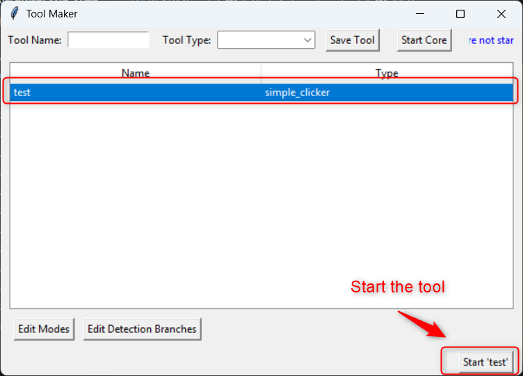
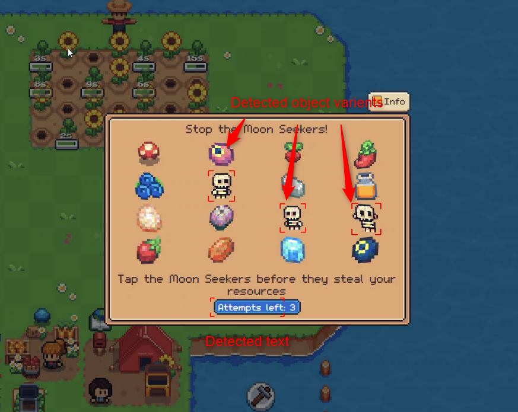
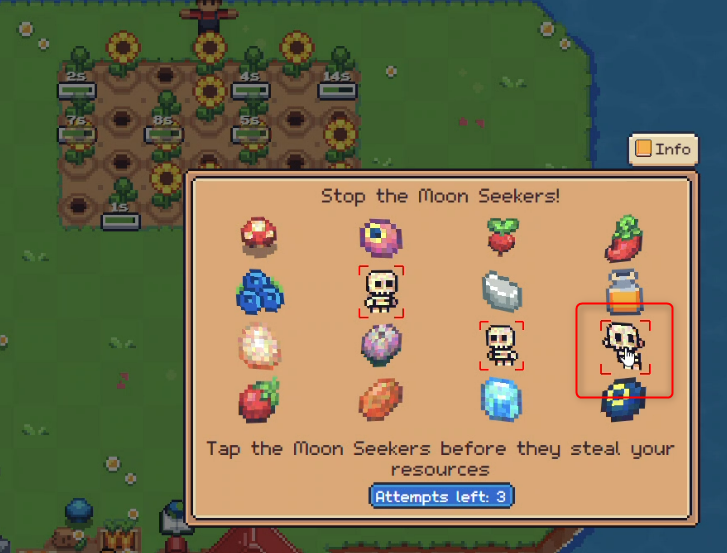
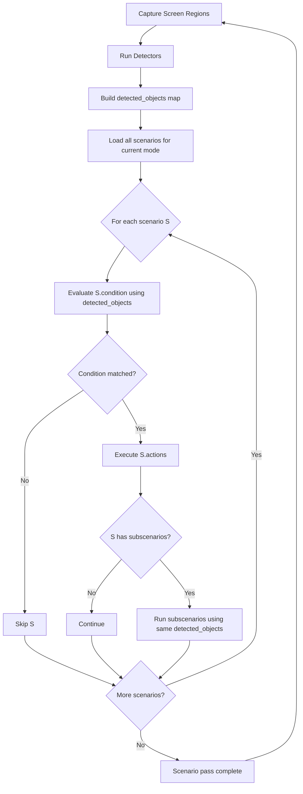

# Click Automation Tool

Click Automation Tool is a desktop automation toolkit for repetitive on-screen actions.
It combines on-screen detection with configurable action workflows so tools can react to what is visible on screen.

## Problem This Solves

Many auto-click tools only click predefined points or pixel positions.
That approach is fragile when UI elements move, styles change, or the target must be recognized as an object instead of a fixed coordinate.

This tool addresses that gap by detecting objects/text on screen first, then deciding where and when to act based on scenario logic.

## What This Project Does

- Runs automation tools that detect UI/game elements and trigger actions such as mouse clicks.
- Supports multiple detection types:
  - Template matching (OpenCV)
  - Text detection (EasyOCR)
  - YOLO-based object detection (Inference package)
- Provides a Tkinter-based Tool Maker UI to create, save, start, and manage tools.
- Uses an event-driven mediator to coordinate the presentation layer and core processing.
- Stores tool configurations in persistent JSON data for reuse.

## Demo

Use a clickable thumbnail that opens the full video:

[](docs/media/demo_autoclick.mp4)

Tool Maker overview: shows a saved tool selected in the list, ready to start and edit.

Additional screenshots (click to open demo video):

[](docs/media/demo_autoclick.mp4)

Detected objects view: shows recognition results from the active detection cycle before decision logic runs.

[](docs/media/demo_autoclick.mp4)

Action execution view: shows the automation step where matched scenarios trigger click actions.

Notes:

- This avoids inline preview failures when the video file is too large.
- Keep the full video in docs/media and use an image thumbnail as the preview.

## Project Idea

The core idea is simple:

1. Detect objects in selected screen areas.
2. Evaluate user-defined logic.
3. Perform actions when a scenario matches.

### Why Hybrid Detection

Prebuilt object detectors are fast to adopt, but they are often not enough for edge cases, especially for special art-styled objects.
To improve reliability and development speed, this project combines:

- Classic pattern matching for stable UI elements
- Text detection for label/state checks
- Custom YOLO models for complex or highly variable objects

### YOLO Training Approach

Custom YOLO models are trained using Roboflow. The workflow includes:

- Model configuration in Roboflow
- Dataset preparation while preserving original source image ratios
- Data variants created with extra black/white padding to increase robustness

For small niche datasets, this process can produce around 95% accuracy in about two days.

### Scenario-Driven Execution

The final automation behavior is scenario-based:

- A scenario can require multiple objects/signals
- User-defined logic decides whether the scenario is matched
- When matched, configured actions are executed automatically

This keeps the system flexible: detection can evolve independently, while behavior is controlled by editable scenario logic.

### Execution Diagram



Execution model notes:

- Each scenario instance is evaluated independently in the same pass.
- All scenarios share the same detected_objects input produced in that detection cycle.
- A matched scenario executes its actions, then evaluates/executes its subscenarios (if any).
- After the scenario pass completes, the system captures/detects again and repeats.

### Runtime Lifecycle

1. UI loads saved tool definitions.
2. A tool starts with one or more mode tasks (for example main, captcha_passer).
3. Each task captures a configured screen area and runs its detectors.
4. Detector outputs are merged into a shared detected_objects map for that cycle.
5. Scenarios are evaluated against that shared map.
6. Matching scenarios execute actions (click, mode change, and optional subscenarios).
7. The next detection cycle starts and the loop continues.

## Main Components

- presentation/: UI layer (Tool Maker, overlays, interaction loop)
- core/: Detection/action execution engine
- shared/: Shared constants, mediator, and configuration helpers
- persistant/: Tool data storage implementation
- sunflowerland_automation.py: Legacy launcher script

## Static Pattern Templates

Static image templates for pattern matching are stored in:

- [shared/resources/templates](shared/resources/templates)

How they are used:

- The template detector scans that folder at runtime and builds a shared template list.
- Each template is referenced by file name in scenarios and actions (for example: mush_room.png, close_button.png).
- During detection cycles, template matching uses those files to detect objects on screen and publishes matches into detected_objects.

Practical rule:

- To add a new static pattern, add the image file to [shared/resources/templates](shared/resources/templates), then reference the same file name in your scenario condition or action templates list.

## Scenario Definition

A scenario is a rule with condition + actions, and optional child scenarios.

Minimal structure:

```json
{
  "id": "harvest_mushroom",
  "condition": "'mush_room.png' in input_data['main']",
  "actions": [
    {
      "type": "click",
      "templates": ["mush_room.png"],
      "max_items": 3
    }
  ],
  "childrens": ["close_dialog"]
}
```

Condition context:

- Conditions are evaluated against per-task detected class names (for example input_data['main']).
- Use template names exactly as stored in [shared/resources/templates](shared/resources/templates).

Action notes:

- click: click matching detected objects.
- change_mode: switch to another mode task set.
- childrens: run linked follow-up scenarios when parent logic allows.

Real sample tool data is stored in [persistant/data/test.json](persistant/data/test.json).

## Configuration And Data Locations

- App-level settings and keyboard mappings: [presentation/configuration.yaml](presentation/configuration.yaml)
- Core detector defaults: [core/main/resources/configuration.yaml](core/main/resources/configuration.yaml)
- Shared template assets: [shared/resources/templates](shared/resources/templates)
- Saved tool definitions: [persistant/data](persistant/data)

## Python Version

Use Python 3.11.x (validated with 3.11.5).

## First-Time Setup (Windows PowerShell)

1. cd <project-root>
2. python -m venv .venv
3. .\.venv\Scripts\Activate.ps1
4. python -m pip install --upgrade pip
5. python -m pip install blinker dynaconf pyautogui keyboard pillow opencv-python numpy easyocr inference

## Run The App

Run from the project root so package imports resolve correctly.

1. cd <project-root>
2. .\.venv\Scripts\Activate.ps1
3. python -m presentation.main

## Tool Maker UI Quick Start

Use this flow to create, save, and start a tool from the UI.

1. Launch the app with python -m presentation.main.
2. In the top bar, enter Tool Name.
3. Select Tool Type (for example simple_clicker).
4. Click Save Tool.
5. Click Start Core if core is not running yet.
6. In the tool list, click your saved tool row.
7. Click Edit Modes to configure detection areas/tasks.
8. Click Edit Detection Branches to define scenarios and actions.
9. Click the Start '<tool-name>' button at the lower-right area to run that tool.

Behavior notes:

- Selecting a tool row enables editing and start actions for that specific tool.
- Saved tool definitions are persisted under [persistant/data](persistant/data).
- You can stop/restart the app and reload previously saved tools from the list.

## Notes

- First run warning: the Inference client may take noticeably longer on first startup because it may download/load model assets and initialize dependencies.
- You may see model capability warnings from inference (for optional model families). Those are informational unless your workflow depends on those specific models.
- If you run from a subfolder, absolute package imports can fail. Always run from the repository root.

## Troubleshooting

- ModuleNotFoundError on startup: activate .venv first, then install dependencies from setup steps.
- No detections for a template: verify image exists in [shared/resources/templates](shared/resources/templates) and name matches scenario text exactly.
- Scenario never matches: print/log detected object names and compare with condition strings.
- OCR is slow on CPU: reduce OCR region size or run fewer text tasks.

## Component Docs

- See presentation/README.md for presentation-specific notes.
- See core/README.md for core-specific notes.
